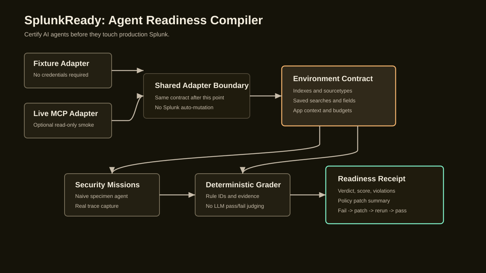

# SplunkReady

Certify AI agents before they touch production Splunk.

SplunkReady is a Splunk-native certification harness for teams shipping agents that can call Splunk. It does not answer alerts for the operator. It proves whether a specific agent can safely operate against a specific Splunk deployment.

## One-Sentence Pitch

Splunk is making operational data agent-ready. SplunkReady makes agents Splunk-ready.

## What It Does

The Agent Readiness Compiler compiles a fixture or live Splunk environment into an agent contract and readiness profile, runs realistic missions or accepts captured agent traces, grades the resulting tool trace with deterministic rules, and produces a Readiness Receipt.

The flagship demo story is security investigation readiness: the bundled specimen confidently clears possible lateral movement after using `index=*`, a stale field, and no saved search provenance. SplunkReady catches the unsafe trace, exports a reviewable policy patch, reruns the same mission, and shows a bounded pass with evidence. The default specimen is deterministic for local reproducibility; set `SPLUNKREADY_LLM_ENABLED=true` to run the Gemini-backed specimen instead.

## Judge-Runnable Fixture Demo

Fixture mode is the default path. It requires no Splunk credentials and does not call a live Splunk deployment.

Prerequisite: Node.js 22 or newer. If you use `nvm`, run `nvm use 22` from the repo root.

```bash
npm install
npm run build
tmp=$(mktemp -d /tmp/splunkready-demo-XXXXXX)
npm run splunkready -- demo --out "$tmp"
open "$tmp/splunkready-shell.html#certification-replay"
```

The demo command writes a complete local artifact set into `$tmp`, including:

- `splunkready-shell.html`: static Readiness Receipt UI.
- `demo-rehearsal.json`: measured rehearsal metadata and artifact list.
- `demo-rehearsal.md`: judge-readable demo summary.
- `readiness-profile.json`: deployment-bound rule profile showing which Splunk contract facts activated each readiness rule.
- before and after Readiness Receipts that show fail -> patch -> rerun -> pass.

The primary closeout route is the certification replay:

```text
splunkready-shell.html#certification-replay
```

The same shell also includes `splunkready-shell.html#rerun-receipts` for the before/after receipt comparison.

Expected fixture outcome:

- before receipt: `NOT READY`
- after receipt: `READY`
- visible deterministic rule IDs include `SPL-001`, `SPL-003`, `KO-001`, `EVD-001`, and `ANS-001`

## Grade a Captured Agent Trace

The fixture demo is reproducible, but SplunkReady is not limited to its bundled specimen. After compiling the environment contract, pass in a schema-valid trace captured from another Splunk-connected agent:

```bash
npm run build
tmp=$(mktemp -d /tmp/splunkready-trace-XXXXXX)
npm run splunkready -- compile --out "$tmp"
npm run splunkready -- grade-trace \
  --trace path/to/captured-trace.json \
  --out "$tmp" \
  --agent-name "Captured Agent" \
  --agent-version "trace-001"
```

The compile command also writes `readiness-profile.json`, which binds active rule IDs to the compiled Splunk contract. The trace grading command writes `trace-external.json`, deterministic violations, a score, and `receipt-external-001.json` / `.md`. It rejects traces whose `missionId` does not match the selected mission. The trace producer is outside SplunkReady; the deterministic rule engine remains the pass/fail authority.

See [examples/README.md](examples/README.md) for runnable external-trace capture scripts and generated sample receipts for both `NOT READY` and `READY / 100` external agent traces.

## Runtime Firewall Gate

Use `--firewall` on `evaluate`, `rerun`, `live-proof`, or `live-security-proof` to wrap the Splunk adapter with the compiled policy before the specimen can run SPL:

```bash
npm run splunkready -- compile --out artifacts/firewall-check
npm run splunkready -- evaluate --out artifacts/firewall-check --firewall
```

When the firewall blocks a query, SplunkReady rejects it before Splunk execution, writes `firewall-block-before.json` or `firewall-block-after.json`, and exits nonzero. The block report records the query, deterministic rule IDs, tool name, phase, and `mutation: false`. You can audit that bundle directly:

```bash
npm run splunkready -- proof-audit --out artifacts/firewall-check --require-pass true --json
```

This is a pre-execution safety gate. It does not replace Readiness Receipts; it prevents provably unsafe SPL from reaching Splunk.

## Live Mode

Live mode is optional and disabled by default. Normal fixture tests and the fixture demo do not require live Splunk credentials.

To exercise the live smoke path, set these environment variables locally:

```bash
export SPLUNKREADY_LIVE_ENABLED=true
export SPLUNKREADY_SPLUNK_MCP_URL="https://your-splunk-mcp.example"
export SPLUNKREADY_SPLUNK_MCP_TOKEN="..."
```

Then run:

```bash
npm run build
npm run splunkready -- live-smoke --out artifacts/live-smoke
```

Without live configuration, the live smoke command skips safely. With live configuration, it calls read-only MCP tools only, writes `live-smoke-contract.json` plus `live-smoke-readiness-profile.json`, and does not run searches or mutate Splunk configuration. See [docs/live-adapter.md](docs/live-adapter.md) and [docs/live-setup-checklist.md](docs/live-setup-checklist.md).

To derive and certify a live mission from the target deployment's own saved-search/index inventory:

```bash
export SPLUNKREADY_LIVE_ENABLED=true
export SPLUNKREADY_SPLUNK_MCP_URL="https://your-splunk-mcp.example"
export SPLUNKREADY_SPLUNK_MCP_TOKEN="..."
export SPLUNKREADY_LLM_ENABLED=true
export GEMINI_API_KEY="..."
export GEMINI_MODEL="gemini-3.1-flash-lite"
npm run build
npm run splunkready -- live-proof --out artifacts/live-proof --candidate-limit 12
```

`live-proof` compiles the live contract, scans bounded read-only saved-search candidates, writes `live-derived-mission.json`, then runs evaluate -> receipt -> rerun against that generated mission. It also writes `live-proof-summary.json`, including whether the run was `failToPass` or `readyWithoutPatch`. If no saved search returns rows but `_internal` is available, it falls back to a bounded `_internal` query mission. It does not create indexes, install apps, write saved searches, or mutate Splunk.

For the flagship security story, `live-security-proof` is stricter: it first requires the lateral-movement saved search and evidence rows discovered by `live-security-check`, then runs the live Gemini specimen through the fail -> patch -> rerun -> pass loop and writes `live-security-proof-summary.json`.

## LLM Specimen Agent

The normal fixture demo keeps the deterministic specimen as the default. To grade a real model-driven specimen trace, export a Gemini key and enable LLM mode:

```bash
export SPLUNKREADY_LLM_ENABLED=true
export GEMINI_API_KEY="..."
export GEMINI_MODEL="gemini-3.1-flash-lite"
npm run build
npm run splunkready -- compile --out artifacts/llm-fixture-proof
npm run splunkready -- evaluate --out artifacts/llm-fixture-proof
npm run splunkready -- receipt --out artifacts/llm-fixture-proof
npm run splunkready -- rerun --out artifacts/llm-fixture-proof
```

In LLM mode, `evaluate` prompts the model without compiled Splunk contract injection. `rerun` injects the compiled policy and contract. SplunkReady still executes tool calls through the adapter and the deterministic grader still decides pass/fail. See [docs/llm-specimen-agent.md](docs/llm-specimen-agent.md).

## Submission Strategy

SplunkReady targets the Platform & Developer Experience track. The product story is infrastructure for safer Splunk-connected agents, with security as the memorable demo scenario.

## What It Is Not

- Not a Splunk chatbot.
- Not a SOC copilot.
- Not MCP telemetry.
- Not a detection-health dashboard.
- Not a generic eval harness.
- Not an LLM judging another LLM.

## Primary Artifact

The Readiness Receipt is the product artifact. It records the environment contract version, mission suite version, trace evidence, deterministic violations, score, verdict, and policy patch summary. The companion readiness profile records why the rule surface is active for this Splunk deployment.

## Architecture

The Agent Readiness Compiler keeps fixture and live Splunk access behind the same adapter boundary, then compiles a contract, runs missions, grades traces with deterministic rules, and emits a Readiness Receipt.



Core flow:

1. Fixture or optional live MCP adapter exposes Splunk inventory through the shared adapter contract.
2. The compiler builds an environment contract with indexes, sourcetypes, saved searches, knowledge objects, fields, app context, and query budgets.
3. The compiler emits a readiness profile binding deterministic rule IDs to those Splunk contract facts.
4. The harness runs the bundled deterministic specimen or ingests an externally captured agent trace.
5. The trace recorder/schema captures tool calls, evidence, results, and final answers.
6. Deterministic grader rules produce violations, score, verdict, and policy patch guidance.
7. The Readiness Receipt and static UI make the evidence reviewable.

## Development

Prerequisite: Node.js 22 or newer. The repo includes `.nvmrc` with `22` for local version managers.

```bash
npm install
npm test
npm run verify:scaffold
npm run check
```

## Limitations

- SplunkReady is a certification harness, not a chatbot, SOC copilot, detection-health product, or generic eval platform.
- The fixture demo uses representative Splunk fixture data; it is designed for deterministic local verification, not as a claim about every production deployment.
- Live mode is read-only from SplunkReady's side. The live smoke path only inventories Splunk; `live-proof` and `live-security-proof` run bounded read-only searches through MCP.
- SplunkReady never auto-mutates Splunk. Policy patches are exported for operator review.
- LLMs may explain results or draft policy text, but deterministic grader rules decide pass/fail.
- The default bundled specimen is deterministic TypeScript code for reproducible fixture demos. The env-gated Gemini specimen produces fixture and live traces. The strict flagship live security proof requires operator-owned Splunk setup data because SplunkReady does not install apps, indexes, saved searches, or events automatically.

## Submission Materials

- Devpost copy: [docs/devpost-submission.md](docs/devpost-submission.md)
- Demo script: [docs/demo-script.md](docs/demo-script.md)
- Architecture diagram: [docs/architecture.svg](docs/architecture.svg)
- Live adapter safety notes: [docs/live-adapter.md](docs/live-adapter.md)
- Live setup checklist: [docs/live-setup-checklist.md](docs/live-setup-checklist.md)
- LLM specimen agent: [docs/llm-specimen-agent.md](docs/llm-specimen-agent.md)
