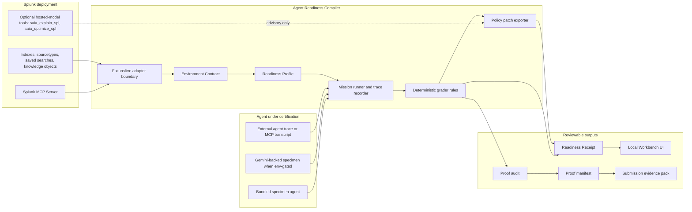

# SplunkReady Architecture Diagram

## Boundary Notes

- Fixture and live Splunk paths share the same adapter interface before the compiler sees data.
- The grader is deterministic wherever possible. Hosted-model output can explain or suggest policy patches, but it is not the pass/fail authority.
- SplunkReady never auto-mutates Splunk. Policy patches are review artifacts.
- The workbench is a local review surface for receipts, proof audits, manifests, redacted exports, and run evidence.
- The tracked evidence pack lives in `submission-evidence/` and can be verified from a clean clone.
