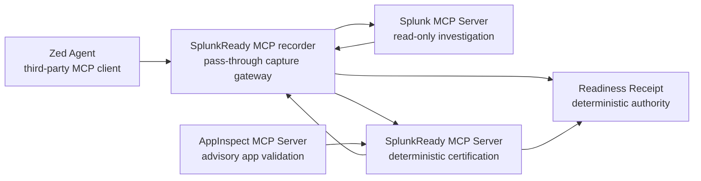

# MCP Topology

SplunkReady's MCP category story is composition, not replacement.

## What Is Proven

- SplunkReady exposes an MCP server with certification tools, reusable
  resources, one receipt resource template, and prompts for agent-driven
  certification workflows.
- The credential-free proof composes a mock Splunk MCP server with SplunkReady
  certification and records dual-server JSON-RPC frames.
- AppInspect MCP is used as advisory static validation for the `.spl` package;
  SplunkReady remains the deterministic receipt authority.
- Zed Agent consumed the recorder gateway and triggered Splunk investigation
  calls against the mock Splunk MCP server.
- The captured frames were certified into a `READY` Readiness Receipt with
  `mutation: false`.

## Current Boundary

The tracked Zed JSONL is real third-party-client evidence from a Zed Agent
session. It contains 15 frames, Splunk investigation frames, a visible
`splunkready_recorder_flush` frame, adjacent certification artifacts, and a
`READY` receipt with score 100. The proof remains credential-free and uses the
mock Splunk MCP path, so do not describe it as an operator-live Splunk session.

## Evidence

- `submission-evidence/mcp-proof/mcp-proof-summary.json`
- `submission-evidence/mcp-proof/dual-server-session.jsonl`
- `submission-evidence/mcp-proof/mock-splunk-mcp-session.jsonl`
- `submission-evidence/mcp-proof/appinspect-mcp-composition.json`
- `submission-evidence/mcp-proof/zed-client-session/zed-mcp-recorder-session.jsonl`
- `submission-evidence/mcp-proof/zed-client-session/mcp-transcript-certification.json`
- `submission-evidence/mcp-proof/zed-client-session/receipt-external-001.json`
- `submission-evidence/screenshots/zed-mcp-strong-session.png`
- `submission-evidence/screenshots/zed-mcp-strong-receipt.png`
